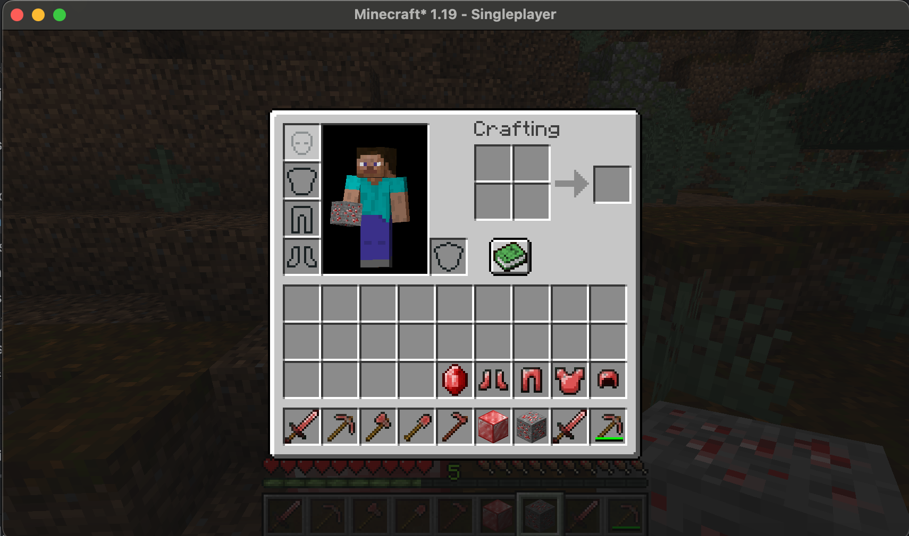

# Ruby Mod

## Overview
The Ruby Mod adds various ruby-themed items and blocks to Minecraft 1.19. This repository includes the mod file (rubymod-0.0.1-1.19.jar) as well as the files used to make the mod. The resources folder contains all textures/models I created for the mod. The rubymod folder contains the files for the items added. 

## Features

- Ruby Ore Blocks: Mine these blocks to obtain rubies. Ore spawns randomly underground.
- Rubies: A new gem used to craft tools and armor. 
- Ruby Blocks: Craftable from rubies, used for decoration or storage.
- Ruby Tools:
  - Ruby Pickaxe
  - Ruby Axe
  - Ruby Hoe
  - Ruby Sword
- Ruby Armor:
  - Ruby Chestplate
  - Ruby Boots
  - Ruby Helmet
  - Ruby Leggings

## Demo: Mining/crafting/item usage

## Installation

1. **Minecraft 1.19 required**.

2. **Download the Mod**:
   - Simply download the jar file from this repository and place it in the mods folder of your Minecraft directory.

## Usage

- **Ruby Ore Blocks**: Found underground, mine them to obtain rubies.
- **Crafting Recipes**:
  - All use standard recipes for ore armor/tools.

